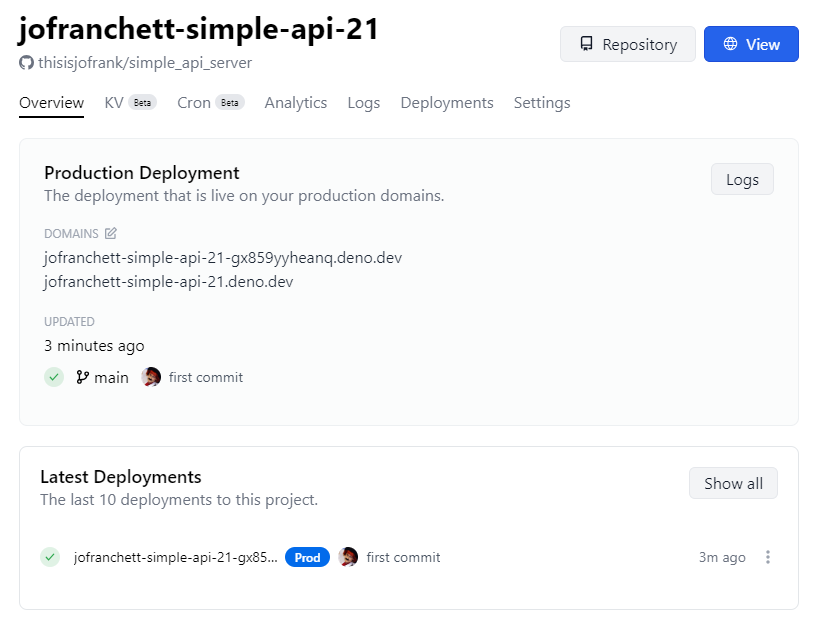

Deno is great for creating simple, light-weight API servers. Learn how to create
and deploy one using Deno Deploy in this tutorial.

## Create a local API server

In your terminal, create a file named `server.ts`.

```shell
touch server.ts
```

We'll implement a simple link shortener service using a
[Deno KV database](/deploy/kv/manual).

```ts title="server.ts"
const kv = await Deno.openKv();

Deno.serve(async (request: Request) => {
  // Create short links
  if (request.method == "POST") {
    const body = await request.text();
    const { slug, url } = JSON.parse(body);
    const result = await kv.set(["links", slug], url);
    return new Response(JSON.stringify(result));
  }

  // Redirect short links
  const slug = request.url.split("/").pop() || "";
  const url = (await kv.get(["links", slug])).value as string;
  if (url) {
    return Response.redirect(url, 301);
  } else {
    const m = !slug ? "Please provide a slug." : `Slug "${slug}" not found`;
    return new Response(m, { status: 404 });
  }
});
```

You can run this server on your machine with this command:

```shell
deno run -A --unstable-kv server.ts
```

This server will respond to HTTP `GET` and `POST` requests. The `POST` handler
expects to receive a JSON document in request the body with `slug` and `url`
properties. The `slug` is the short URL component, and the `url` is the full URL
you want to redirect to.

Here's an example of using this API endpoint with cURL:

```shell
curl --header "Content-Type: application/json" \
  --request POST \
  --data '{"url":"https://docs.deno.com/runtime/manual","slug":"denodocs"}' \
  http://localhost:8000/
```

In response, the server should send you JSON with the KV data representing the
result of the `set` operation:

```json
{ "ok": true, "versionstamp": "00000000000000060000" }
```

A `GET` request to our server will take a URL slug as a path parameter, and
redirect to the provided URL. You can visit this URL in the browser, or make
another cURL request to see this in action!

```shell
curl -v http://localhost:8000/denodocs
```

Now that we have an API server, let's push it to a GitHub repository that we'll
later link to Deno Deploy.

## Create a GitHub repository for your app

Sign in to [GitHub](https://github.com) and
[create a new repository](https://docs.github.com/en/get-started/quickstart/create-a-repo).
You can skip adding a README or any other files for now - a blank repo will do
fine for our purposes.

In the folder where you created your API server, initialize a local git repo
with these commands in sequence. Be sure to swap out `your_username` and
`your_repo_name` with the appropriate values.

```sh
echo "# My Deno Link Shortener" >> README.md
git init
git add .
git commit -m "first commit"
git branch -M main
git remote add origin https://github.com/your_username/your_repo_name.git
git push -u origin main
```

You should now have a GitHub repository with your `server.ts` file in it, as in
[this example repository](https://github.com/kwhinnery/simple_api_server). Now
you're ready to import and run this application on Deno Deploy.

## Import and deploy your project

Next, sign up for an account on [Deno Deploy](https://dash.deno.com) and
[create a new project](https://dash.deno.com/new_project). Connect your GitHub
account and select the repository we created a moment ago.


The configuration should look something like this:


Click on the "Deploy Project" button. Once deployed, your link shortener service
will be live on Deno Deploy!



## Test out your new link shortener

Without any additional configuration (Deno KV just works on Deploy), your app
should run the same as it did on your local machine.

You can add new links using the `POST` handler as you did before. Just replace
the `localhost` URL with your live production URL on Deno Deploy:

```shell
curl --header "Content-Type: application/json" \
  --request POST \
  --data '{"url":"https://docs.deno.com/runtime/manual","slug":"denodocs"}' \
  https://your-deno-project-url-here.deno.dev/
```

Similarly, you can visit your shortened URLs in the browser, or view the
redirect coming back with a cURL command:

```shell
curl -v https://your-deno-project-url-here.deno.dev/denodocs
```

If you enjoyed this project, next you could check out a higher-level web
framework like [Fresh](https://fresh.deno.dev), or learn more about
[Deno KV here](/deploy/kv/manual). Great work deploying your simple API server!
