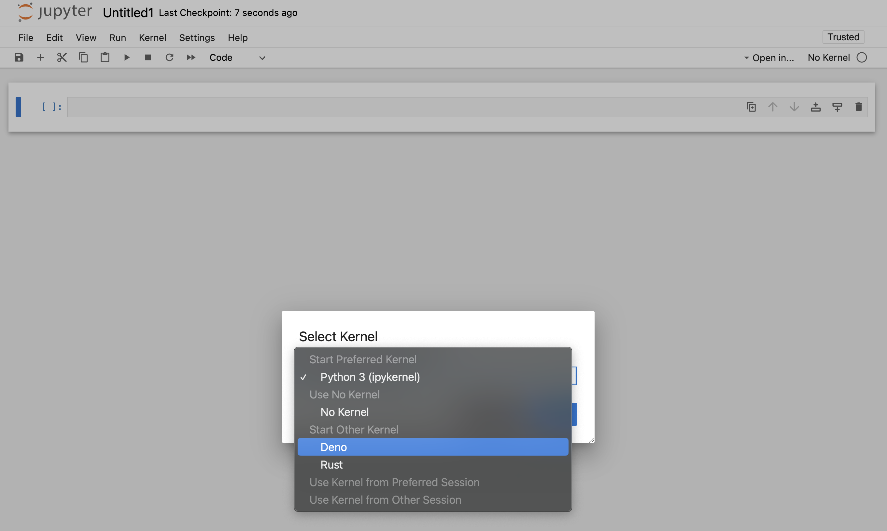

# Jupyter Kernel for Deno

<p>
<span class="theme-doc-version-badge badge badge--secondary">
Available since <b>1.37.0</b>
</span>
</p>

Deno ships with a built-in Jupyter kernel that allows you to write JavaScript
and TypeScript; use Web and Deno APIs and import `npm` packages straight in your
interactive notebooks.

:::caution `deno jupyter` is currently unstable

`deno jupyter` is currently an unstable feature and thus requires the
`--unstable` flag. We intend to stabilize this feature in an upcoming release.

:::

## Quickstart

Run `deno jupyter --unstable` and follow the instructions.

You can run `deno jupyter --unstable --install` to force installation of the
kernel. Deno assumes that `jupyter` command is available in your `PATH`.

After completing the installation process, the Deno kernel will be available in
notebook creation dialog.



You can use Deno Jupyter kernel in any editor that supports Jupyter notebooks,
eg. in VSCode, you can use
[VSCode Jupyter extension](https://marketplace.visualstudio.com/items?itemName=ms-toolsai.jupyter),
while in JetBrains IDEs Jupyter notebooks should be available out of the box.

## Rich content output

Deno Jupyter kernel allows you to display rich content in your notebooks
[using MIME types that Jupyter supports](https://docs.jupyter.org/en/latest/reference/mimetype.html).

To do that, you need to return any JavaScript object that has a
`[Symbol.for("Jupyter.display")]` method. This method should return a dictionary
mapping a MIME type to a value that should be displayed.

```ts
{
  [Symbol.for("Jupyter.display")]() {
    return {
      // Plain text content
      "text/plain": "Hello world!",

      // HTML output
      "text/html": "<h1>Hello world!</h1>",
    }
  }
}
```

Since it's _just_ a function, you can use any library you want to format the
output. This is not tied to Deno itself in any way, because we're using a
regular JavaScript symbol index.

## `jupyter console` integration

You can also use Deno Jupyter kernel in the `jupyter console` REPL. To do that,
you should launch your console with `jupyter console --kernel deno`.


